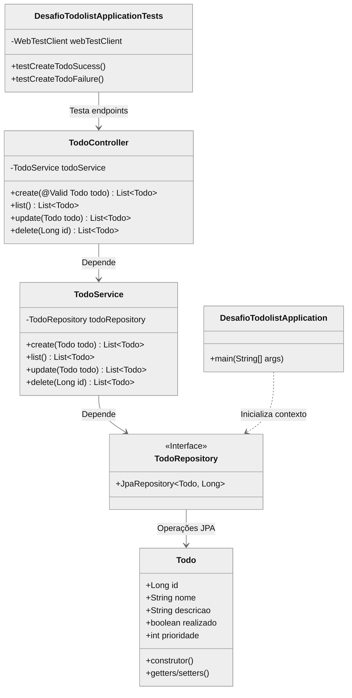

# 📝 ToDo List API

API RESTful para gerenciamento de tarefas com **Spring Boot 3**, **validações**, **testes automatizados** e persistência em **MySQL** (produção) ou **H2** (testes).

## 🛠 Tecnologias

[](https://www.oracle.com/java/)
[](https://spring.io/projects/spring-boot)
[](https://spring.io/projects/spring-data-jpa)
[](https://hibernate.org)
[](https://www.mysql.com/)
[](https://www.h2database.com)
[](https://maven.apache.org)

## 🚀 Tecnologias
- Java 17
- Spring Boot 3
- Spring Data JPA
- MySQL / H2 (testes)
- Lombok (se aplicável)
- WebTestClient (testes)

## 📋 Endpoints

| Método | Rota         | Descrição                          |
|--------|--------------|-----------------------------------|
| POST   | `/todos`     | Cria uma nova tarefa              |
| GET    | `/todos`     | Lista tarefas (ordenadas)         |
| PUT    | `/todos`     | Atualiza uma tarefa               |
| DELETE | `/todos/{id}`| Remove uma tarefa                 |


### 🔄 Ordenação
As tarefas são retornadas ordenadas por:
1. **Prioridade** (decrescente)
2. **Nome** (crescente)

## ⚙️ Configuração

### 🛠️ Produção (MySQL)
Edite `src/main/resources/application.properties`:
```properties
spring.datasource.url=jdbc:mysql://localhost:3306/todolist
spring.datasource.username=root
spring.datasource.password=123456
spring.jpa.hibernate.ddl-auto=update
```
## 🧪 Testes (H2)

Configuração automática em src/test/resources/application-test.properties:
spring.datasource.url=jdbc:h2:mem:testdb

## 🧪 Testes de integração com WebTestClient:

@Test
void testCreateTodoSuccess() {
    webTestClient
        .post().uri("/todos")
        .bodyValue(new Todo("Estudar", "Spring Boot", false, 1))
        .exchange()
        .expectStatus().isOk();
}

## ▶️ Como Executar

```
# Produção (MySQL)
mvn spring-boot:run

# Testes
mvn test
```
## 📦 Exemplo de JSON

Request (POST /todos):
```
{
  "nome": "Estudar JPA",
  "descricao": "Praticar relações",
  "realizado": false,
  "prioridade": 2
}
```
## 📌 Validações

- @NotBlank nos campos nome e descricao
- Retorno HTTP 400 para dados inválidos

# Autor
[Alexsandro Almeida](https://linkedin.com/in/alexsandro-j-a-almeida)
